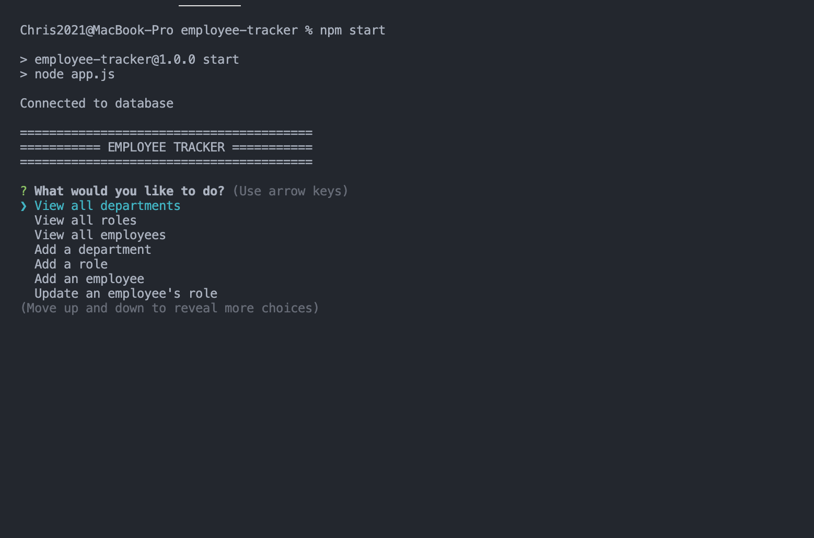
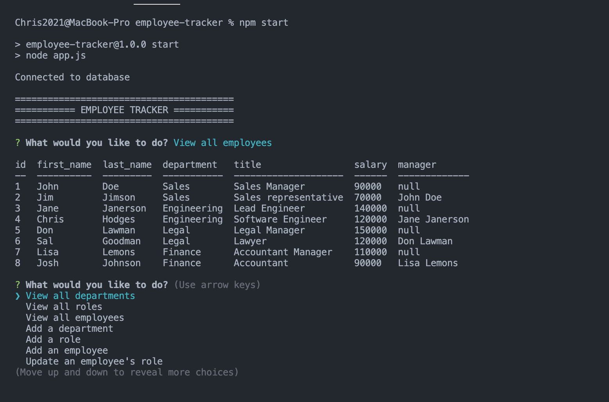
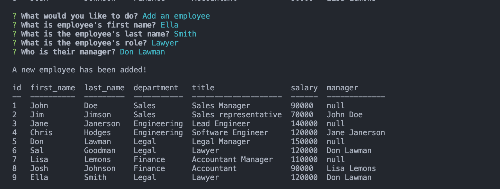

# Employee Tracker

## Description
This is a command-line application designed to keep track of employees.  It utilizes node.js, MySQL, and inquirer.  The user is prompted to choose from the following options:
    "View all departments",
    "View all roles",
    "View all employees",
    "Add a department",
    "Add a role",
    "Add an employee",
    "Update an employee's role",
    "View department budget".

## Installation/Directions
First, install required dependencies by running "npm install" in the command line.  Fill in your MySQL username and password into connection.js.  Then run MySQL by typing "mysql -u root - p" and enter your password.  Type "source db/schema.sql" and then "source db/seeds.sql" to populate the database with example data.  Type "quit" to exit MySQL.   Next, run the application by typing "npm start".  Use the arrow keys to choose an option and follow the prompts.  Enter "control C" to exit.

##  Screenshots

 
 
 

## Demo Video
https://drive.google.com/file/d/1jvBEEKEx2lKP08b0R4hrlSmri0HhPan-/view

## Contributions
Created by Chris Hodges

## Questions
For any questions, contact me at chrisdhodges12@gmail.com or find me on GitHub at https://github.com/chrisdhodges12

